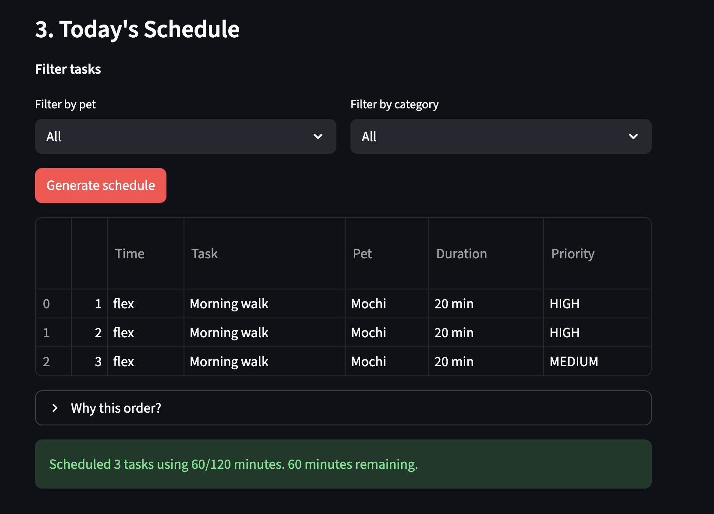
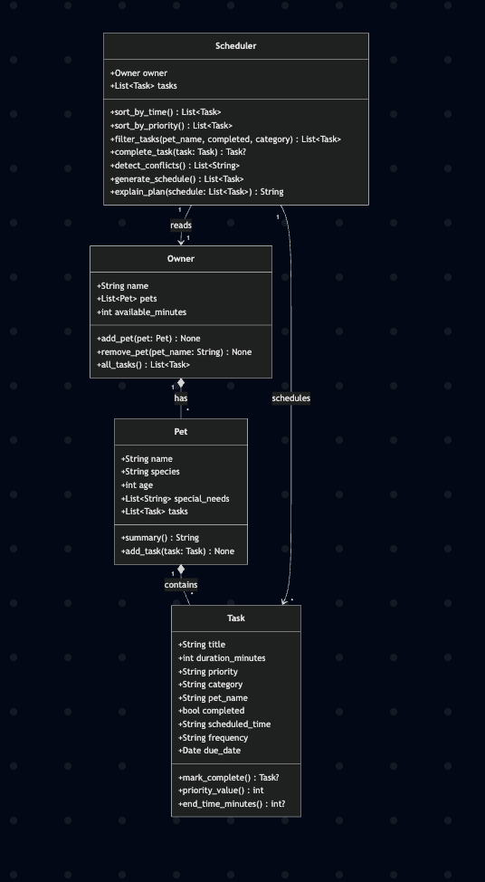

# PawPal+ (Module 2 Project)

You are building **PawPal+**, a Streamlit app that helps a pet owner plan care tasks for their pet.

## Scenario

A busy pet owner needs help staying consistent with pet care. They want an assistant that can:

- Track pet care tasks (walks, feeding, meds, enrichment, grooming, etc.)
- Consider constraints (time available, priority, owner preferences)
- Produce a daily plan and explain why it chose that plan

Your job is to design the system first (UML), then implement the logic in Python, then connect it to the Streamlit UI.

## What you will build

Your final app should:

- Let a user enter basic owner + pet info
- Let a user add/edit tasks (duration + priority at minimum)
- Generate a daily schedule/plan based on constraints and priorities
- Display the plan clearly (and ideally explain the reasoning)
- Include tests for the most important scheduling behaviors

## Demo

<!-- TODO: Replace with your actual screenshot after running `streamlit run app.py` -->
<a href="assets/demo_screenshot.png" target="_blank"></a>

### System Architecture

<a href="assets/uml_final.png" target="_blank"></a>

## Classes

| Class | Responsibility |
|-------|---------------|
| **Task** | Represents a single care activity. Holds title, duration, priority, category, scheduled time, frequency, due date, and completion status. Can mark itself complete and auto-generate the next recurring occurrence. |
| **Pet** | Stores pet profile info (name, species, age, special needs) and owns a list of Tasks. Provides methods to add tasks and produce a summary. |
| **Owner** | Manages multiple Pets and a daily time budget (`available_minutes`). Aggregates all tasks across pets. Supports JSON save/load for data persistence. |
| **Scheduler** | The scheduling brain. Retrieves tasks from the Owner, sorts by time or priority, filters by pet/status/category, detects time conflicts, finds next available slots, and generates a time-budgeted daily plan with explanations. |

## Features

- **Owner & Pet management** — Register multiple pets with name, species, age, and special needs
- **Task creation** — Add care tasks with duration, priority, category, scheduled time, and recurrence
- **Smart scheduling** — Generates a daily plan: timed tasks first (by clock), then flexible tasks by priority, within the owner's time budget
- **Sorting** — Sort tasks chronologically or by priority
- **Filtering** — Filter by pet, completion status, or category
- **Recurring tasks** — Daily/weekly tasks auto-generate the next occurrence when completed
- **Conflict detection** — Warns when task time ranges overlap (including across pets)
- **Plan explanation** — The scheduler explains why tasks are ordered the way they are and which were skipped
- **Next available slot** — Finds the earliest gap in the day that fits a task of a given duration
- **Data persistence** — Save/load owner, pets, and tasks to `data.json` between sessions
- **Emoji-coded UI** — Priority levels (\U0001f534/\U0001f7e1/\U0001f7e2) and task categories (\U0001f6b6/\U0001f356/\U0001f48a/\u2702\ufe0f/\U0001f9f8) are color-coded in both the Streamlit app and CLI output

## Smarter Scheduling

PawPal+ includes several algorithmic features beyond basic task listing:

- **Sort by time** — Tasks with a `scheduled_time` (HH:MM) are sorted chronologically; unscheduled tasks appear at the end.
- **Sort by priority** — Tasks are ranked high > medium > low for quick triage.
- **Filter tasks** — Filter by pet name, completion status, or category (walk, feed, medicine, etc.).
- **Recurring tasks** — Daily and weekly tasks automatically generate their next occurrence when marked complete, using `timedelta` for accurate date math.
- **Conflict detection** — The scheduler scans for overlapping time ranges and returns human-readable warnings instead of crashing.
- **Smart schedule generation** — Time-slotted tasks are placed first (by clock time), then flexible tasks fill remaining time by priority, all within the owner's daily time budget.

## Testing PawPal+

Run the full test suite with:

```bash
python -m pytest tests/ -v
```

The suite includes **48 tests** covering:

| Area | What's tested |
|------|---------------|
| Task basics | Completion, priority mapping |
| Pet & Owner | Summaries, add/remove pets, task aggregation |
| Sorting | Chronological order, priority order, unscheduled-last |
| Filtering | By pet, status, category, combined criteria |
| Recurring tasks | Daily/weekly recurrence, attribute preservation, one-time tasks |
| Conflict detection | Overlapping ranges, back-to-back, cross-pet, completed-task exclusion |
| Schedule generation | Time budget, priority ordering, timed-before-flex, edge cases |
| Next available slot | Gap before/between/after tasks, fully booked day, empty schedule |
| JSON persistence | Task/Pet/Owner round-trip, save-to-file and load-back, missing file |
| Display helpers | Emoji priority and category formatting |

**Confidence level: 4/5** — All 48 tests pass; remaining gap is Streamlit integration and midnight-spanning tasks.

## Getting started

### Setup

```bash
python -m venv .venv
source .venv/bin/activate  # Windows: .venv\Scripts\activate
pip install -r requirements.txt
```

### Run the CLI demo

```bash
python main.py
```

This creates an Owner with two Pets (Mochi the dog, Whiskers the cat), adds 6 tasks with different times and priorities, then demonstrates sorting, conflict detection, schedule generation, next-slot finding, recurring task completion, and JSON persistence — all in the terminal.

### Run the Streamlit app

```bash
streamlit run app.py
```

### Run the tests

```bash
python -m pytest tests/ -v
```

## Stretch Features

### Advanced Algorithm: Next Available Slot (via Agent Mode)

`Scheduler.find_next_slot(duration)` scans the daily timeline (06:00–22:00) and finds the earliest contiguous gap that fits a task of the given duration. **Agent Mode** was used to implement this: I described the desired behavior ("scan occupied intervals and find the first gap of N minutes"), and the AI produced a cursor-based gap-scanning algorithm that handles empty schedules, fully booked days, and gaps between tasks in a single pass.

### Data Persistence (via Agent Mode)

`Owner.save_to_json()` and `Owner.load_from_json()` persist all data to `data.json` between runs. **Agent Mode** orchestrated the multi-file changes: it added `to_dict()`/`from_dict()` serialization to all three dataclasses in `pawpal_system.py`, then updated `app.py` to auto-load on startup and provide Save/Load buttons.

### Advanced Scheduling Logic

The scheduler implements priority-based sorting combined with time-blocking: timed tasks are placed first (chronologically), then flexible tasks fill remaining budget by priority (high > medium > low). Conflict detection prevents overlapping time ranges. Both features are observable in the CLI demo (`main.py`) and the Streamlit UI (`app.py`).

### Professional UI and Output

Both the Streamlit app and CLI demo use emoji-coded priority indicators (🔴 HIGH / 🟡 MEDIUM / 🟢 LOW) and category icons (🚶 walk / 🍖 feed / 💊 medicine / ✂️ grooming / 🧸 enrichment). The CLI uses auto-width aligned ASCII tables for readable output without external dependencies.
