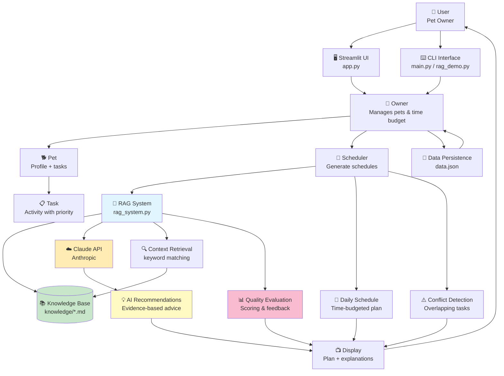

# PawPal+ System Architecture (Module 2 Final)

## System Architecture with RAG Integration



## Component Descriptions

### Core System Components

| Component | Responsibility | Files |
|-----------|---------------|-------|
| **Owner** | Manages pet portfolio and daily time budget | `pawpal_system.py` |
| **Pet** | Stores pet profile (species, age, special needs) and task list | `pawpal_system.py` |
| **Task** | Represents care activities with duration, priority, category, time | `pawpal_system.py` |
| **Scheduler** | Generates time-budgeted schedules, detects conflicts, sorts/filters | `pawpal_system.py` |

### AI Components (NEW - Module 2)

| Component | Responsibility | Files |
|-----------|---------------|-------|
| **RAG System** | Retrieval-Augmented Generation for pet care advice | `rag_system.py` |
| **Knowledge Base** | Evidence-based pet care guidelines (dog, cat) | `knowledge/dog_care_guide.md`<br/>`knowledge/cat_care_guide.md` |
| **Context Retrieval** | Finds relevant knowledge chunks based on pet profile | `rag_system.py` |
| **AI Recommendations** | Uses Claude API to generate personalized advice | `rag_system.py` |
| **Quality Evaluation** | Scores schedules and provides improvement suggestions | `rag_system.py` |

### User Interfaces

| Interface | Purpose | Files |
|-----------|---------|-------|
| **Streamlit UI** | Interactive web app for managing pets and viewing AI advice | `app.py` |
| **CLI Demo** | Command-line demonstration of core features | `main.py` |
| **RAG Demo** | End-to-end RAG system demonstration (3 scenarios) | `rag_demo.py` |
| **Evaluation Harness** | Automated testing of RAG system accuracy | `evaluate_rag.py` |

## Data Flow

### 1. Schedule Generation Flow (Traditional)
```
User Input → Owner → Pet → Tasks → Scheduler → Schedule → Display
```

### 2. AI-Enhanced Flow (NEW)
```
User Input → Pet Profile + Tasks → RAG System → Knowledge Base Retrieval →
Claude API → AI Recommendations → Quality Evaluation → Display
```

### 3. Evaluation Flow (NEW)
```
Test Cases → RAG System → Knowledge Retrieval + AI Generation →
Scoring (keyword matching) → Pass/Fail Results → Report
```

## Key Integrations

1. **RAG ↔ Knowledge Base**: RAG system retrieves relevant chunks from markdown documents
2. **RAG ↔ Claude API**: Retrieved context + pet profile sent to Claude for intelligent recommendations
3. **Scheduler ↔ RAG**: Scheduler can request AI advice for schedule quality
4. **Persistence ↔ Owner**: All data saved to JSON for cross-session continuity

## AI Feature: Retrieval-Augmented Generation (RAG)

**What it does:**
- Retrieves evidence-based pet care information from curated knowledge base
- Uses Claude AI to generate personalized recommendations based on:
  - Pet species, age, special needs
  - Scheduled tasks and priorities
  - Owner's time constraints
- Evaluates schedule quality and provides actionable feedback

**Why RAG:**
- Ensures recommendations are grounded in best practices (not hallucinated)
- Provides citations/context from veterinary guidelines
- Adapts to individual pet needs while following general principles
- Catches critical issues (e.g., diabetic medication timing)

**Observable Behavior:**
- Run `python rag_demo.py` to see 3 scenarios with AI recommendations
- Run `python evaluate_rag.py` to test accuracy on 6 test cases
- Check `knowledge/` folder for source documents

## Export Instructions

To create a PNG diagram:
1. Copy the Mermaid code above
2. Visit https://mermaid.live/
3. Paste the code
4. Click "Export as PNG"
5. Save to `assets/architecture_diagram.png`
